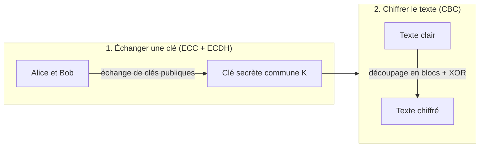

<p align="center">
  
</p>

<p align="center">
  Cryptosystème hybride échange de clé ECDH sur courbe elliptique puis chiffrement symétrique en mode CBC en Python pur
</p>

<p align="center">
  
  
  
  
</p>

## Sommaire

- [Fonctionnalités](#fonctionnalités)
  - [Schéma d'ensemble](#schéma-densemble)
- [Documentation](#documentation)
- [Installation](#installation)
  - [Prérequis](#prérequis)
  - [Clonage et dépendances](#clonage-et-dépendances)
- [Utilisation](#utilisation)
  - [Tests](#tests)
  - [Qualité du code](#qualité-du-code)
- [Licence](#licence)

## Fonctionnalités

- Échange de clé sécurisé (ECDH) sur courbe elliptique, pas à pas
- Chiffrement symétrique en mode CBC, bloc par bloc (padding PKCS#7)
- Saisie de **texte libre** (lettres, chiffres, caractères spéciaux, espaces compris)
- Exemple complet avec calculs numériques vérifiables
- Affichage détaillé des 9 étapes (binaire, XOR, blocs, IV)
- Vérification automatique par déchiffrement à la fin

### Schéma d'ensemble



## Documentation

Toutes les explications, les concepts et l'exemple de A à Z sont détaillés dans le [wiki du projet](https://github.com/jobiyax/ecc-cbc-crypto/wiki).

| #   | Sujet                    | Lien                                                                                              |
| --- | ------------------------ | ------------------------------------------------------------------------------------------------- |
| 0   | Accueil                  | [Home](https://github.com/jobiyax/ecc-cbc-crypto/wiki)                                            |
| 1   | Les courbes elliptiques  | [Les-courbes-elliptiques](https://github.com/jobiyax/ecc-cbc-crypto/wiki/Les-courbes-elliptiques) |
| 2   | L'échange de clé ECDH    | [L-echange-de-cle-ECDH](https://github.com/jobiyax/ecc-cbc-crypto/wiki/L-echange-de-cle-ECDH)     |
| 3   | Le mode CBC              | [Le-mode-CBC](https://github.com/jobiyax/ecc-cbc-crypto/wiki/Le-mode-CBC)                         |
| 4   | Exemple complet de A à Z | [Exemple-complet](https://github.com/jobiyax/ecc-cbc-crypto/wiki/Exemple-complet)                 |

## Installation

### Prérequis

- Python 3.14 ou plus
- [uv](https://docs.astral.sh/uv/) (gestionnaire de paquets et d'environnement)

Vérifier

```bash
python --version
uv --version
```

### Clonage et dépendances

```bash
git clone https://github.com/jobiyax/ecc-cbc-crypto.git
cd ecc-cbc-crypto
uv sync  # installe les dépendances + dépendances de dev dans .venv
```

> Sans uv, utilisez `python -m venv .venv && source .venv/bin/activate && pip install -e ".[dev]"`

## Utilisation

Lancez le programme

```bash
uv run python src/main.py
```

Le CLI vous demande successivement

1. `dA` (clé privée d'Alice)
2. `dB` (clé privée de Bob)
3. Le **texte à chiffrer** (texte, chiffres, accents, emojis, espaces…)
4. La personnalisation de `p/a/b` et de la taille de bloc _(optionnel)_

Chaque champ affiche sa valeur par défaut entre crochets. **Entrée** la valide.

### Tests

```bash
uv run pytest  # lance toute la suite
uv run pytest -v  # avec le détail de chaque test
```

### Qualité du code

```bash
uv run ruff check .  # lint (vérifie le style et les erreurs)
uv run ruff format .  # format (reformate automatiquement le code)
```

## Licence

Distribué sous licence MIT. Voir [LICENSE](LICENSE).
