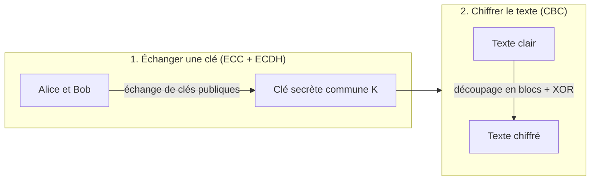

  

## Description

Un **cryptosystème hybride** : les courbes elliptiques (ECC) permettent d'échanger une clé secrète en toute sécurité, et le mode CBC utilise ensuite cette clé pour chiffrer le texte.

## Fonctionnalités

- Échange de clé sécurisé (ECDH) sur courbe elliptique
- Chiffrement symétrique en mode CBC, bloc par bloc
- Exemple pédagogique complet avec calculs numériques vérifiables (courbe $p = 23$, message « BONJOUR »)
- Diagrammes Mermaid et formules LaTeX

## Schéma d'ensemble

## Documentation

Toutes les explications, les concepts et l'exemple de A à Z sont détaillés dans le dossier [`docs/`](docs/) :

| #   | Sujet                    | Lien                                |
| --- | ------------------------ | ----------------------------------- |
| 1   | Les courbes elliptiques  | [01-ecc.md](docs/01-ecc.md)         |
| 2   | L'échange de clé ECDH    | [02-ecdh.md](docs/02-ecdh.md)       |
| 3   | Le mode CBC              | [03-cbc.md](docs/03-cbc.md)         |
| 4   | Exemple complet de A à Z | [04-exemple.md](docs/04-exemple.md) |
