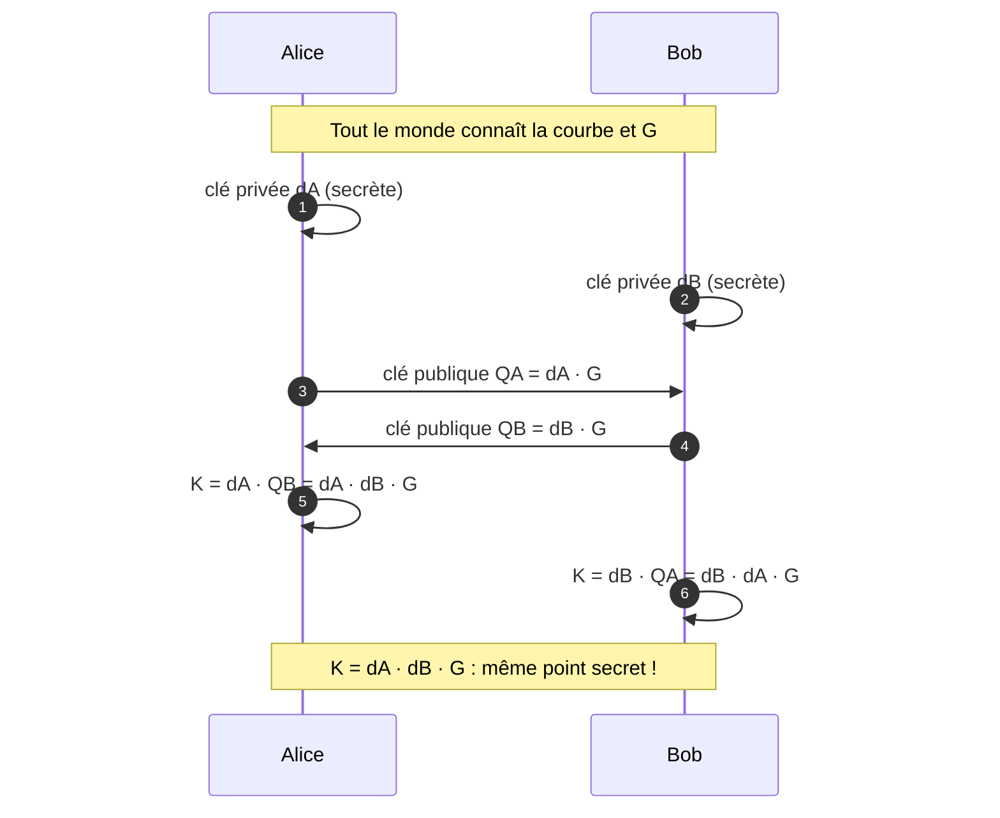

# 2. L'échange de clé ECDH

## 2.1 Le problème à résoudre

Dans l'exercice, Alice et Bob veulent chiffrer un message avec le mode CBC. Pour cela, ils ont besoin d'une **clé secrète commune**.

Mais comment partager cette clé **sans l'envoyer sur le réseau** ? Si Alice envoie la clé à Bob, un attaquant (Eve) qui intercepte la conversation la récupère aussi. Tout l'intérêt d'Alice et Bob tombe à l'eau.

**Solution : l'échange de clé Diffie-Hellman sur courbes elliptiques (ECDH).**

## 2.2 Le principe général (Diffie-Hellman)

L'idée de Whitfield Diffie et Martin Hellman (1976) :

> Chacun combine **sa clé privée** avec **la clé publique de l'autre**, et tout le monde arrive au même résultat secret — sans jamais transmettre ce résultat.

Cela fonctionne grâce à une propriété des courbes elliptiques : l'addition de points est **commutative et associative**, donc multiplier par $d_A$ puis par $d_B$ donne le même point que multiplier par $d_B$ puis par $d_A$ :

$$ d_A \cdot (d_B \cdot G) = d_B \cdot (d_A \cdot G) = d_A d_B \cdot G $$

## 2.3 Les étapes du protocole ECDH

Tout le monde (Alice, Bob, et même Eve) connaît publiquement la courbe et le point générateur $G$.

### Étape 1 — Alice génère ses clés

- clé privée : $d_A$ (un nombre secret, choisi au hasard)
- clé publique : $Q_A = d_A \cdot G$

### Étape 2 — Bob génère ses clés

- clé privée : $d_B$ (secret)
- clé publique : $Q_B = d_B \cdot G$

### Étape 3 — Ils échangent leurs clés publiques

Alice reçoit $Q_B$, Bob reçoit $Q_A$. **Eve peut aussi les voir, ce n'est pas grave.**

### Étape 4 — Alice calcule la clé partagée

$$ K = d_A \cdot Q_B = d_A \cdot (d_B \cdot G) = d_A d_B \cdot G $$

### Étape 5 — Bob calcule la clé partagée

$$ K = d_B \cdot Q_A = d_B \cdot (d_A \cdot G) = d_B d_A \cdot G $$

### Étape 6 — Le point de rencontre

Comme $d_A d_B = d_B d_A$, Alice et Bob obtiennent **exactement le même point** :

$$ K = d_A d_B \cdot G $$

|              | Alice                                            | Bob                                           |
| ------------ | ------------------------------------------------ | --------------------------------------------- |
| Clé privée   | $d_A$ (secret)                                   | $d_B$ (secret)                                |
| Clé publique | $Q_A = d_A \cdot G \longrightarrow$ reçoit $Q_A$ | reçoit $Q_B \longleftarrow Q_B = d_B \cdot G$ |
| Clé partagée | $K = d_A \cdot Q_B$                              | $K = d_B \cdot Q_A$                           |
| Résultat     | $K = d_A d_B \cdot G$                            | $K = d_B d_A \cdot G$                         |

## 2.4 Visualisation du schéma complet

### Diagramme de séquence

## 2.5 Pourquoi Eve ne peut pas calculer K ?

Eve voit uniquement les valeurs publiques : $G$, $Q_A = d_A G$ et $Q_B = d_B G$.

Pour obtenir $K = d_A d_B G$, elle devrait :

1. soit retrouver $d_A$ à partir de $Q_A$ (résoudre l'**ECDLP**, quasi impossible) ;
2. soit calculer $d_A d_B G$ directement à partir de $Q_A$ et $Q_B$ (le **problème de Diffie-Hellman computationnel (CDH)**, également impossible).

C'est ce double mur mathématique qui rend l'ECDH sûr sur de vraies grandes courbes.

## 2.6 Notre exemple numérique

Avec la courbe $E : y^2 = x^3 + x + 1 \pmod{23}$ et $G = (3, 10)$ :

- Alice choisit $d_A = 5$ :
  $$ Q_A = 5G = (9, 16) $$
- Bob choisit $d_B = 7$ :
  $$ Q_B = 7G = (11, 3) $$

Alice calcule :

$$ K = d_A \cdot Q_B = 5 \cdot (11, 3) = (11, 3) $$

Bob calcule :

$$ K = d_B \cdot Q_A = 7 \cdot (9, 16) = (11, 3) $$

Les deux obtiennent le même point $K = (11, 3)$. On retrouve bien :

$$ K = d_A d_B G = 35G = (11, 3) $$

La coordonnée $x$ de ce point servira de clé symétrique pour le CBC :

$$ K_x = 11 $$

> **Remarque :** sur notre petite courbe, le point **G** a un ordre de 28, donc **35G = 7G**. Sur une vraie courbe, les ordres sont astronomiquement grands et ce phénomène n'existe pas.

## 2.7 Applications réelles

L'ECDH est utilisé partout où deux machines doivent établir une clé secrète commune :

- **TLS 1.3** (connexions HTTPS sécurisées) ;
- **Signal / WhatsApp** (cryptage de bout en bout, via X25519) ;
- **Bitcoin et Ethereum** (dérivation de clés).

## 2.8 Récapitulatif

1. Chacun garde sa **clé privée** $d$, et publie sa **clé publique** $Q = dG$.
2. On échange les clés publiques (elles peuvent être vues par tout le monde).
3. Chacun combine : $K = d_A Q_B = d_B Q_A = d_A d_B G$.
4. Tout le monde obtient **la même clé secrète**, sans jamais l'avoir envoyée.
5. Eve ne peut pas la retrouver (ECDLP et CDH impossible).
