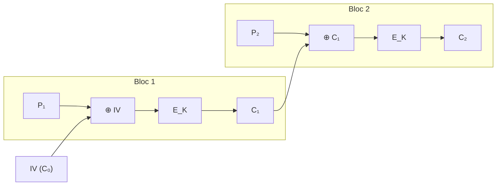

# 3. Le mode CBC

## 3.1 Pourquoi a-t-on besoin d'un mode de chiffrement ?

Un chiffrement par bloc (comme AES ou DES) ne sait chiffrer qu'**un seul bloc** d'une taille fixe (par exemple 128 bits). Mais un texte fait en général plusieurs blocs !

Le **mode de chiffrement** (CBC, CTR, GCM…) décrit **comment enchaîner les blocs**.

Le mode CBC (_Cipher Block Chaining_, « chaînage de blocs de chiffrement ») est le plus connu et le plus utilisé historiquement.

> **Rappel du contexte de l'exercice :** la clé secrète $K$ créée par l'ECC/ECDH va servir à chiffrer le texte bloc par bloc avec le mode CBC. C'est la partie **symétrique et rapide** du système.

## 3.2 L'idée générale

1. Le texte clair est découpé en **blocs** de taille fixe.
2. Chaque bloc clair est d'abord combiné (XOR) avec le **bloc chiffré précédent**.
3. Le résultat est chiffré avec la clé $K$.

Ainsi, chaque bloc chiffré **dépend de tous les blocs précédents** : d'où le nom de « chaînage ».

$$
\begin{aligned}
C_1 &= E_K(P_1 \oplus IV) \\[2pt]
C_2 &= E_K(P_2 \oplus C_1) \\[2pt]
C_3 &= E_K(P_3 \oplus C_2) \\[2pt]
&\ \vdots
\end{aligned}
$$

## 3.3 La formule mathématique

Chiffrement :

$$ C*i = E_K(P_i \oplus C*{i-1}) \qquad \text{avec } C_0 = IV $$

Déchiffrement :

$$ P*i = D_K(C_i) \oplus C*{i-1} $$

### Signification des symboles

| Symbole  | Signification                             |
| -------- | ----------------------------------------- |
| $P_i$    | $i$-ième bloc de texte clair              |
| $C_i$    | $i$-ième bloc de texte chiffré            |
| $K$      | clé secrète (issue de l'ECDH)             |
| $E_K$    | fonction de chiffrement avec la clé $K$   |
| $D_K$    | fonction de déchiffrement avec la clé $K$ |
| $\oplus$ | opération **XOR** (ou exclusif)           |
| $IV$     | vecteur d'initialisation ($C_0$)          |

## 3.4 Le découpage en blocs et le remplissage

Le texte est découpé en blocs de taille fixe. Notre texte « BONJOUR » (8 lettres) est découpé en blocs de 4 caractères :

$$ \text{BONJOUR} \longrightarrow P_1 = \text{BONJ}, \qquad P_2 = \text{OURX} $$

Le dernier bloc doit avoir la même taille que les autres. S'il est trop court, on ajoute un **remplissage** (padding). Ici, le « X » final est du remplissage :

$$ P_1 = \text{BONJ} \qquad P_2 = \text{OURX} $$

En pratique, on utilise souvent le remplissage **PKCS#7** : on ajoute $n$ octets de valeur $n$ pour compléter le dernier bloc. Notre exemple utilise un simple caractère « X » pour rester simple.

> **Note :** le remplissage est une étape sensible en sécurité (attaques par « padding oracle »). En production, on préfère souvent des modes sans remplissage comme CTR ou GCM.

## 3.5 L'opération XOR

Le XOR (ou exclusif) est une opération bit à bit :

- $0 \oplus 0 = 0$
- $0 \oplus 1 = 1$
- $1 \oplus 0 = 1$
- $1 \oplus 1 = 0$

Autrement dit : le XOR de deux bits donne **1 s'ils sont différents**, **0 s'ils sont identiques**.

### Exemple

$$ P_1 = 10101010 \qquad IV = 11001100 $$

$$ 10101010 \oplus 11001100 = 01100110 $$

Le XOR est **réversible** : si on re-XOR le résultat avec l'IV, on retrouve le bloc d'origine. C'est cette propriété qui permet le déchiffrement.

## 3.6 L'IV (vecteur d'initialisation)

Pour le premier bloc, il n'y a pas de bloc précédent. On utilise donc un bloc spécial appelé **IV** (_Initialization Vector_) :

$$ C_1 = E_K(P_1 \oplus IV) $$

Rôle de l'IV :

- rendre chaque chiffrement **unique**, même si le message est identique ;
- éviter que deux messages identiques donnent deux textes chiffrés identiques (ce qui trahirait le contenu).

**Bonnes pratiques :**

- L'IV n'a **pas besoin d'être secret**, mais il doit être **imprévisible** (généré avec un générateur aléatoire cryptographique) ;
- Il doit être **différent pour chaque message** chiffré avec la même clé ;
- Il est transmis avec le texte chiffré (il n'est pas confidentiel).

## 3.7 Le chaînage expliqué pas à pas

### Chiffrement en chaîne

### Premier bloc

1. On prend $P_1$.
2. On fait un XOR avec l'IV : $P_1 \oplus IV$.
3. On chiffre le résultat avec la clé $K$ :

$$ C_1 = E_K(P_1 \oplus IV) $$

### Deuxième bloc

1. On prend $P_2$.
2. On fait un XOR avec le bloc chiffré précédent : $P_2 \oplus C_1$.
3. On chiffre le résultat :

$$ C_2 = E_K(P_2 \oplus C_1) $$

### Bloc $i$

$$ C*i = E_K(P_i \oplus C*{i-1}) $$

## 3.8 Avantages et inconvénients du CBC

### Avantages

| Avantage                     | Explication                                                                                         |
| ---------------------------- | --------------------------------------------------------------------------------------------------- |
| Masque les motifs            | Deux blocs clairs identiques ne donnent pas les mêmes blocs chiffrés (grâce au chaînage)            |
| Meilleur que l'ECB           | Contrairement au mode ECB (dangereux), un motif répété n'est pas visible dans le chiffré            |
| Déchiffrement parallélisable | Le déchiffrement de chaque bloc ne dépend que de $C_i$ et $C_{i-1}$ : on peut le faire en parallèle |

### Inconvénients

| Inconvénient               | Explication                                                                                        |
| -------------------------- | -------------------------------------------------------------------------------------------------- |
| Chiffrement séquentiel     | Chaque bloc chiffré dépend du précédent : impossible de chiffrer en parallèle                      |
| Sensible aux erreurs       | Un bit modifié dans $C_i$ corrompt $P_i$ et change $P_{i+1}$                                       |
| Remplissage nécessaire     | Le texte doit être un multiple de la taille de bloc                                                |
| Attaque « padding oracle » | Si le déchiffreur révèle la validité du remplissage, un attaquant peut reconstruire le texte clair |
| Pas d'authentification     | Le CBC chiffre mais ne prouve pas l'intégrité du message (il faut un MAC ou le mode GCM)           |

### Comparaison rapide des modes

| Mode | Remplissage | Parallélisme            | Authentification                  |
| ---- | ----------- | ----------------------- | --------------------------------- |
| ECB  | Oui         | Oui                     | Non (et **insecure**)             |
| CBC  | Oui         | Déchiffrement seulement | Non                               |
| CTR  | Non         | Oui                     | Non                               |
| GCM  | Non         | Oui                     | **Oui** (mode moderne recommandé) |

## 3.9 Le déchiffrement

Pour retrouver le texte clair, on **inverse** le processus :

$$ P*i = D_K(C_i) \oplus C*{i-1} $$

1. On déchiffre $C_i$ avec la clé $K$ : $D_K(C_i)$.
2. On combine le résultat avec le bloc chiffré précédent par un XOR.

C'est exactement l'opération inverse du chiffrement, grâce à la propriété de réversibilité du XOR.

## 3.10 Notre exemple (résumé)

| Élément       | Valeur                       |
| ------------- | ---------------------------- |
| Clé CBC       | $K_x = 11$ (issue de l'ECDH) |
| Texte clair   | BONJOUR                      |
| $P_1$         | BONJ                         |
| $P_2$         | OURX                         |
| IV            | un bloc de départ choisi     |
| $C_1$         | $E_{11}(P_1 \oplus IV)$      |
| $C_2$         | $E_{11}(P_2 \oplus C_1)$     |
| Texte chiffré | $C_1 C_2$                    |

## 3.11 Récapitulatif

- CBC = chaînage de blocs : $C_i = E_K(P_i \oplus C_{i-1})$.
- Le premier bloc utilise l'IV : $C_0 = IV$.
- L'IV rend chaque chiffrement unique, même pour des messages identiques.
- Le chaînage masque les motifs répétés du texte clair.
- Points de vigilance : remplissage, erreurs qui se propagent, absence d'authentification.
